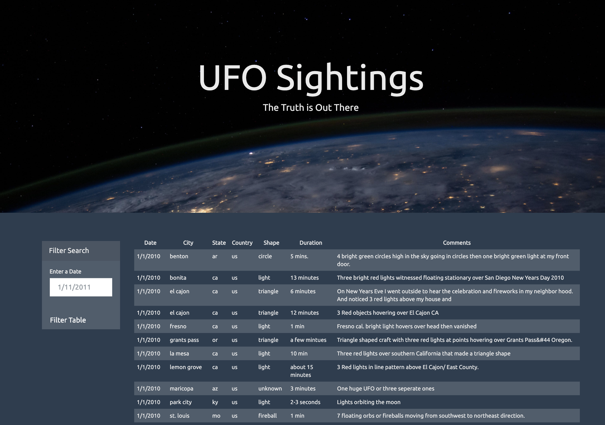
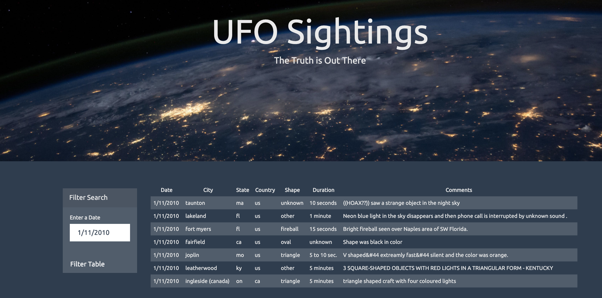
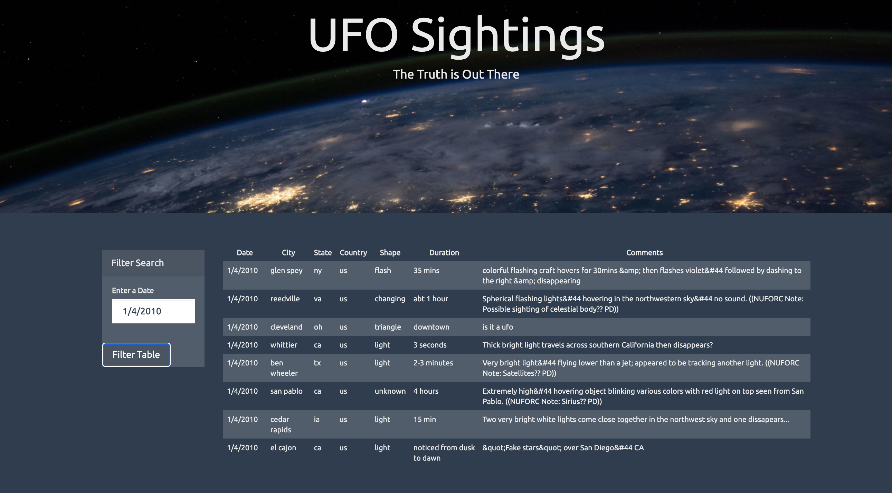

# JavaScript-Challenge
Code used inthis task will create a dynamic table that filters data based on user's selection. 
### Part 1: Automatic Table and Date Search 

* Created a basic HTML web page .

* Using the UFO dataset provided in the form of an array of JavaScript objects, wrote code that appends a table to the web page and then adds new rows of data for each UFO sighting.

* Use a date form in your HTML document and write JavaScript code that will listen for events and search through the `date/time` column to find rows that match user input.

* Another thing to emphasize is that, the data contains entries upto 1/13/2010. It is good to know before doing filters on the data.

* Here's how the output html looks like with one filtering option:

As one enteres a date, and filters, this is how output look like:

Here's another filtering example:

### Features I could do better:
If I had to recreate this assignment, I would add a button called "Original Table" that will be used to get full table data after filtering.

